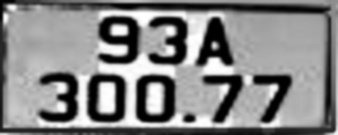
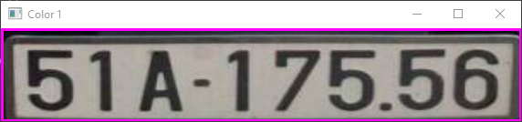
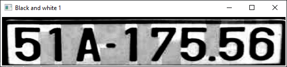
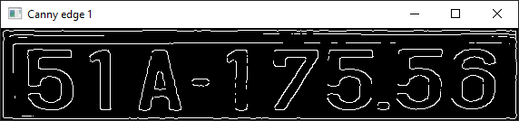
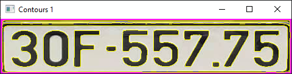

Setup for project

1. Install Python: https://www.python.org/
2. Install Anaconda ( development environment): https://www.anaconda.com/download
3. Run install file requirements.txt (by Terminal on Project)
   Content inside file “requirements.txt”:

pip install -r requirements.txt

ultralytics

opencv-python

easyoc

numpy

4. ultralytics (The YOLO model is used to detect the location of objects in an image and return bounding boxes for each object)
5. opencv-python (OpenCV is used to read, process and display images)
6. easyocr (Use EasyOCR to read text on license plates)

• Detection license_plate_recognition_symbols

Preprocess.py:

Original img: with eacyocr

Start detection
Color img :

Black and White:

Canny Edge Detection:

Find and Draw Contours:

Font text License plate Vietnamese:
[text](Soxe2banh.TTF)

Bonus:  
You can delete all img in \input_images_license_plate , and replace your img in folder
rename_img.py in folder \img_input_rename , replace you input \_path and output_path to rename img to manage it name like number 1.jpg
