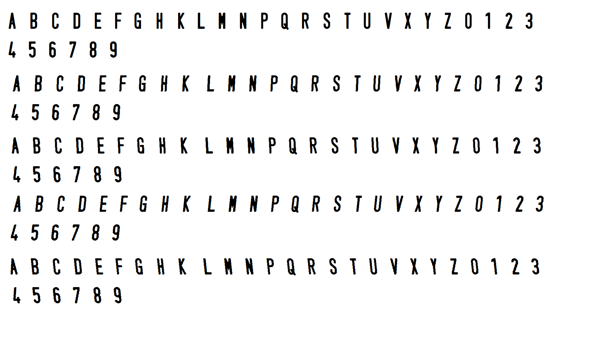
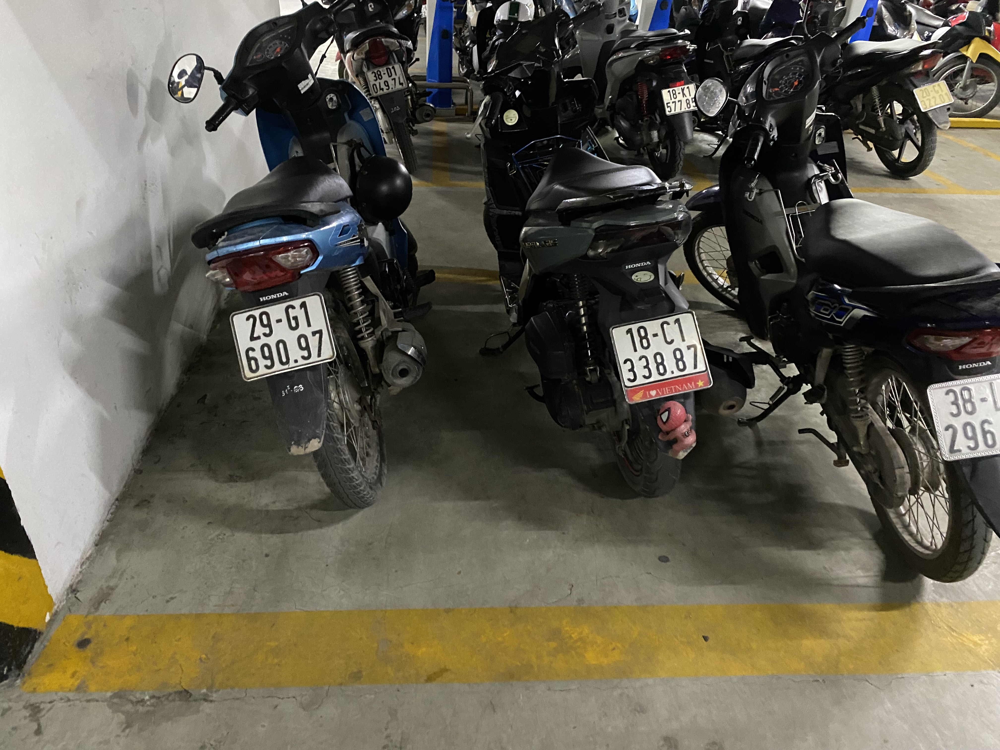
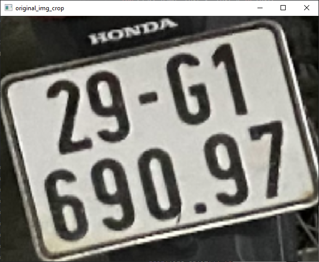
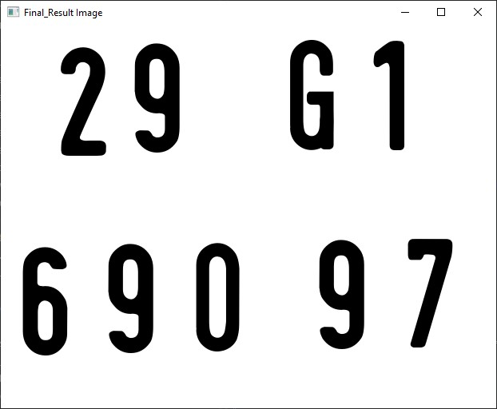

Setup for project

1. Install Python: https://www.python.org/
2. Install Anaconda ( development environment): https://www.anaconda.com/download
3. Run install file requirements.txt (by Terminal on Project)
   Content inside file “requirements.txt”:

pip install -r requirements.txt

ultralytics

opencv-python

easyoc

numpy

4. ultralytics (The YOLO model is used to detect the location of objects in an image and return bounding boxes for each object)
5. opencv-python (OpenCV is used to read, process and display images)
6. easyocr (Use EasyOCR to read text on license plates)

• Detection license_plate_recognition_symbols

Preprocess.py:

Start detection
Color img :

Black and White:

Canny Edge Detection:

Find and Draw Contours:

Font text License plate Vietnamese:

[text](font_bien_so_xe_vn.TTF)

final_v0 (detect-character-by-model + final_result_by EASY OCR)
final_v1 (detect-character-by-model "character_detector.pt")

original_image

original_img got crop_detect ( license_plate_detector.pt )

Image got detect and transform:

Final result:

Bonus:

1. You can delete all img in \input_images_license_plate , and replace your img in folder
   File rename_img.py in folder \img_input_rename , replace you input \_path and output_path to rename img to manage it (ex: 1.jpg , 2.jpg) 1.jpg

2. [text](Running_YOLOv8_Webcam/Empty_all_output_img.py) this file to clean up all output images folder
